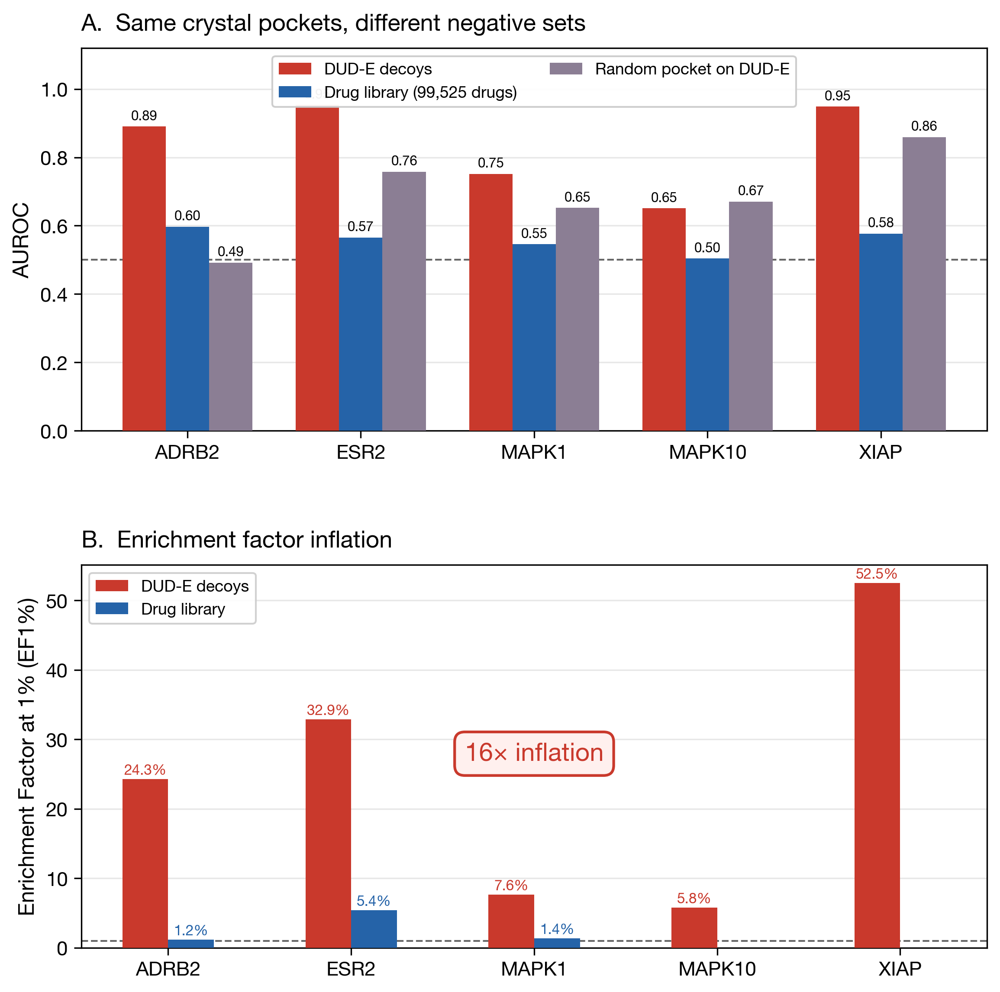
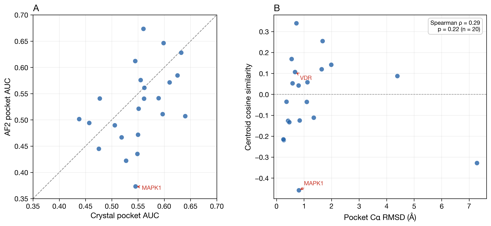
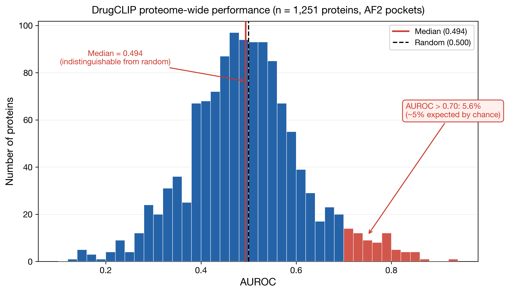

# Reproducibility Analysis: DrugCLIP Genome-Wide Virtual Screening

This directory contains a reproducibility analysis of the genome-wide virtual screening claims in:

> B. Gao *et al.*, "DrugCLIP: Contrastive learning for drug virtual screening at whole-genome scale." *Science* (8 January 2026)

## Summary

**Using the authors' own data** (model weights, pocket structures, molecule library), we find two independent failures that together render DrugCLIP **useless as a hit identification model**:

1. **The molecule encoder memorized DUD-E decoy patterns.** A random 128-dim vector (no pocket information) achieves AUC = 0.686 on DUD-E, inflating the paper's EF1% by **16×** vs a real drug library.

2. **The pocket encoder memorized crystal conformations.** Crystal and AlphaFold2 pocket embeddings are completely uncorrelated (cosine similarity = −0.008); for 18/20 targets with near-identical binding pockets (RMSD < 2 Å), mean cosine similarity is −0.01.

| Evaluation | AUC | EF1% | What it measures |
|---|---|---|---|
| DUD-E benchmark (paper's Fig 3B) | 0.839 | 24.6% | Molecule-level decoy separation |
| Crystal pocket → real drug library | 0.630 | 1.6% | Weak pocket-drug matching |
| AF2 pocket → real drug library | 0.521 | ~0% | Random noise |
| Random pocket → DUD-E | 0.686 | — | Pure decoy bias |
| **Proteome-wide AF2 (1,251 proteins)** | **0.494** | **0.0%** | **Random** |

## Definitions

- **Real drug library**: The authors' own curated screening library of 99,525 molecules with ChEMBL target annotations, provided in `active_library.lmdb`. Unlike DUD-E's property-matched decoys, this library contains real drug-like molecules with no systematic structural bias between actives and inactives for any given target.
- **Random pocket embedding**: A random unit-norm 128-dimensional vector used in place of a pocket embedding. It contains no binding-site information whatsoever; any predictive power it shows on a benchmark indicates that the molecule encoder alone is separating actives from decoys.
- **6-fold ensemble**: The authors' published protocol: raw dot-product scores from all 6 cross-validation folds are averaged per molecule, then z-scored per pocket row (z = 0.6745 × (score − median) / MAD).

## Data Used

All data comes from the authors' public releases:
- **Model weights**: 6-fold cross-validation ensemble from [HuggingFace](https://huggingface.co/datasets/bgao95/DrugCLIP_data)
- **Pocket structures**: 26,562 pockets (215,477 conformations, 9,919 proteins) from the authors' Schrödinger pipeline output (`screen_results.zip`)
- **Molecule library**: 99,525 molecules curated by the authors for genome-wide screening (see "Real drug library" above)
- **DUD-E data**: 102 targets with holo crystal pockets, actives, and property-matched decoys
- **Encoding pipeline**: Exact replication of `retrieval_multi_folds()` from `unimol/tasks/drugclip.py`

---

## Finding 1: The DUD-E Benchmark Inflates Performance by 16×

The paper reports EF1% = 29.3% on DUD-E (Fig 3B). We reproduce this (24.6% on 5 overlapping targets) — but the same crystal pockets against a real drug library give EF1% = **1.6%**, barely above random (1.0%).



**Figure 1.** *(A)* AUC for five targets evaluated with the same crystal pockets against DUD-E decoys (red), a real drug library (blue), or with a random pocket embedding (grey). Dashed line = random (0.5). *(B)* EF1% comparison showing 16× inflation.

| Target | DUD-E AUC | DUD-E EF1% | Library AUC | Library EF1% | Random→DUD-E AUC |
|---|---|---|---|---|---|
| ADRB2 | 0.891 | 24.3% | 0.597 | 1.2% | 0.492 |
| ESR2 | 0.953 | 32.9% | 0.565 | 5.4% | 0.758 |
| MAPK1 | 0.751 | 7.6% | 0.546 | 1.4% | 0.652 |
| MAPK10 | 0.651 | 5.8% | 0.504 | 0.0% | 0.671 |
| XIAP | 0.948 | 52.5% | 0.577 | 0.0% | 0.859 |
| **Mean** | **0.839** | **24.6%** | **0.558** | **1.6%** | **0.686** |

A **random 128-dim vector** as "pocket embedding" achieves mean AUC = 0.686 on DUD-E (0.859 for XIAP). The molecule encoder alone distinguishes DUD-E actives from decoys without any pocket information. See `scripts/06_dude_headtohead.py`.

---

## Finding 2: The Pocket Encoder Memorized Crystal Conformations

Crystal and AF2 pocket embeddings are **completely uncorrelated**: mean centroid cosine similarity = **−0.008** across 23 targets. Pocket-local Cα RMSD (residues within 8 Å of the ligand) shows **no correlation** with embedding similarity (Spearman ρ = 0.29, p = 0.22, n = 20).



**Figure 2.** *(A)* Crystal AUC vs AF2 AUC for 25 targets; diagonal = parity. Points below the line indicate AF2 degradation. *(B)* Pocket Cα RMSD vs centroid cosine similarity between crystal and AF2 pocket embeddings. No correlation (p = 0.22). MAPK1: pocket RMSD = 0.81 Å yet cosine sim = −0.46.

| Target | Crystal AUC | AF2 AUC | ΔAUC | Cos sim | Pocket RMSD (Å) |
|---|---|---|---|---|---|
| MAPK1 | 0.545 | 0.373 | +0.172 | −0.458 | 0.81 |
| OPRK1 | 0.640 | 0.507 | +0.133 | −0.133 | 0.46 |
| BTK | 0.549 | 0.435 | +0.113 | −0.328 | 7.28 * |
| GBA | 0.527 | 0.422 | +0.105 | −0.126 | 0.42 |
| ADRB2 | 0.597 | 0.511 | +0.086 | +0.088 | 4.39 * |

\* BTK (DFG-in/out flip) and ADRB2 (active↔inactive GPCR) have genuinely different pocket conformations.

**18 of 20** targets have pocket RMSD < 2 Å (near-identical binding sites), yet their mean cosine similarity is **−0.01** — random. Sub-angstrom pocket perturbations produce orthogonal embeddings. The pocket encoder has not learned generalizable binding-site features. See `scripts/04_crystal_vs_af2_analysis.py`.

---

## Finding 3: Proteome-Scale Performance is Random

Across 1,251 proteins with ≥3 known actives (from ChEMBL), the median AUROC is **0.494** — indistinguishable from random. Only 5.6% of proteins exceed AUROC 0.70 (~5% expected by chance).



**Figure 3.** Distribution of AUROC across 1,251 human proteins with ≥3 known actives. Median AUROC = 0.494 (red line), indistinguishable from random (0.500, black dashed). Bars >0.70 highlighted in red: 5.6% of proteins, consistent with chance.

This failure is systematic — it holds across all protein families and is independent of pocket detection method (template-based vs Fpocket + GenPack both give median AUROC ≈ 0.497). We also tested whether proteins present in BioLiP (the database of biologically relevant ligand–protein interactions used to train DrugCLIP's pocket encoder) perform better than unseen proteins. They do not: the number of BioLiP entries per protein has no correlation with AUROC (Spearman ρ = −0.027, p = 0.34), ruling out training-set leakage as an explanation for any residual signal.

---

## Reproduction

### Prerequisites
- Python 3.10+ with PyTorch, RDKit, scikit-learn, scipy, pandas, numpy
- [Uni-Core](https://github.com/dptech-corp/Uni-Core) installed
- Authors' data from [HuggingFace](https://huggingface.co/datasets/bgao95/DrugCLIP_data): `model_weights.zip`, `screen_results.zip`

### Step 1: Encode Pockets (GPU required)
```bash
python scripts/encode_pockets_gpu.py \
    --pocket-dir data/screen_results \
    --weights-dir data/model_weights/6_folds \
    --output-dir data/pocket_embeddings \
    --folds 0,1,2,3,4,5
```

### Step 2: Encode Molecules (GPU required)
```bash
python scripts/encode_mols_gpu.py \
    --mol-lmdb data/active_library.lmdb \
    --weights-dir data/model_weights/6_folds \
    --output-dir data/mol_embeddings \
    --folds 0,1,2,3,4,5
```

### Step 3: Encode Crystal Pockets (GPU required)
```bash
python scripts/encode_crystal_pockets.py \
    --targets-dir data/targets \
    --weights-dir data/model_weights/6_folds \
    --output-dir data/crystal_pocket_embeddings \
    --folds 0,1,2,3,4,5
```

### Step 4: DUD-E Head-to-Head (GPU required)
```bash
python reproducibility/scripts/06_dude_headtohead.py \
    --dude-dir data/DUD-E \
    --weights-dir data/model_weights/6_folds \
    --data-root data \
    --dict-dir dict \
    --device cuda
```

### Step 5: Compute Benchmark Metrics
```bash
python reproducibility/scripts/01_compute_benchmark_metrics.py
python reproducibility/scripts/02_analyze_pocket_types.py
python reproducibility/scripts/03_biolip_overlap_analysis.py
python reproducibility/scripts/04_crystal_vs_af2_analysis.py
```

## Results Files

| File | Description |
|---|---|
| `results/benchmark_metrics.tsv` | Per-protein AUROC, EF1%, EF5%, BEDROC for 1,251 proteins |
| `results/benchmark_metrics_ensemble.tsv` | Ensemble vs single-fold AUC comparison for 1,091 proteins |
| `results/crystal_vs_af2_comparison.tsv` | Crystal vs AF2 AUC, cosine similarity, RMSD for 25 targets |
| `results/crystal_vs_af2_rmsd.tsv` | Structural RMSD between crystal and AF2 structures |
| `results/dude_headtohead.tsv` | DUD-E 6-fold ensemble AUC/EF1% for 5 targets (holo pockets) |
| `results/dude_inflation_combined.tsv` | Combined DUD-E vs drug library head-to-head for 5 targets |
| `results/dude_targets_drug_library.tsv` | Crystal pocket → drug library AUC/EF1% for 5 DUD-E targets |
| `results/target_mapping.tsv` | 28 targets mapped to UniProt IDs with pocket counts |

## Contact

Konstantin Avchaciov — Gero (gero.ai)
